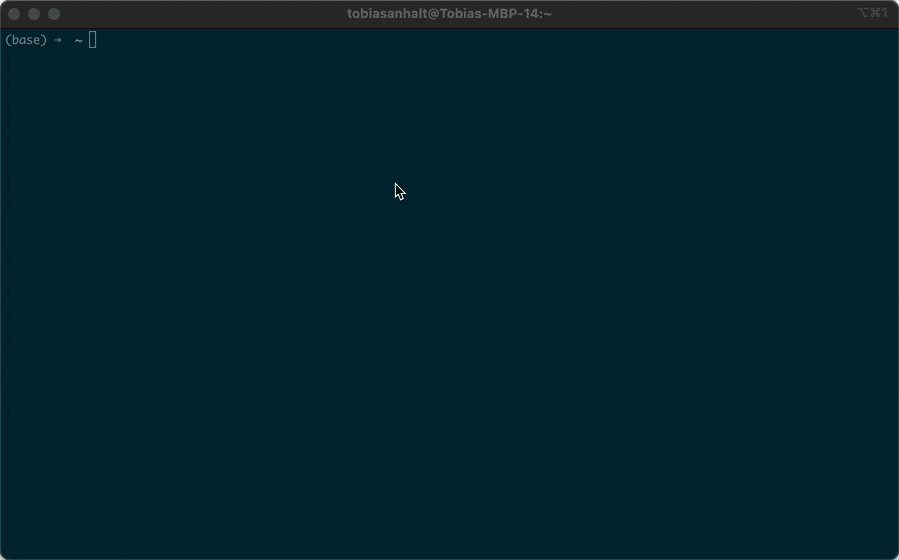

# Hack Your Brain with Bash: Program Your Habits

Inspired by James Clear's "Atomic Habits," this hackable Bash script is your toolkit for programming your brain to build better habits.

It is the result of living a productive life as programmer with ADHS. Trust me, its hard.



## Ready commands
- **Zen Mode**: `hack switch zen` - Blocks everythign distracting
- **News Timer**: `hack switch news` - Solve challenges and get some news & social media time
- **Work Mode**: `hack switch work` - Unblocks all work related messengers
- **Clear Mode**: `clear` - Unblocks everything after solving challenges

## Atomic Habits Principles
This script is a practical application of the principles from "Atomic Habits":

- **Cue Elimination**: Zen Mode removes the triggers of bad habits.
- **Increase friction of bad habits**: Default to Zen simplifies maintaining focus and having to complete challenges increases the friction of bad habits.
- **Make good habits easy**: The script always brings you back to zen so being in the flow without distractions becomes your new normal. 
- **Identity Reinforcement**: Each use is a vote for the person you're becoming.
  "Every action you take is a vote for the type of person you wish to become." – James Clear

## Installation
1. Install the script:
   ```bash
   curl -sL https://raw.githubusercontent.com/Mythli/hack-your-brain-with-bash/main/src/download.sh | bash
   ```
2. Personalize your habit plan:
   ```bash
   hack edit
   ```
3. Engage Zen Mode for focus:
   ```bash
   hack switch zen
   ```
4. Start hacking your brain
   ```bash
   hack edit vim
   ```
5. List all modes
   ```bash
   hack list
   ```

5. Print mode information
   ```bash
   hack print zen
   ```

## Hackable Features
- Customize with `hack edit` to block any app or site.
- Comes with over 50,000 distracting domain names which you can use
- Comes with 3 challenge types: Mantra completion, Math and physical exercises.
- Modify challenges and rewards to fit your goals.

"Habits are the compound interest of self-improvement." – James Clear

## Have an idea?
PRs welcome.
